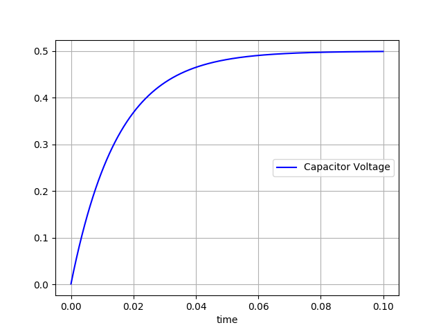
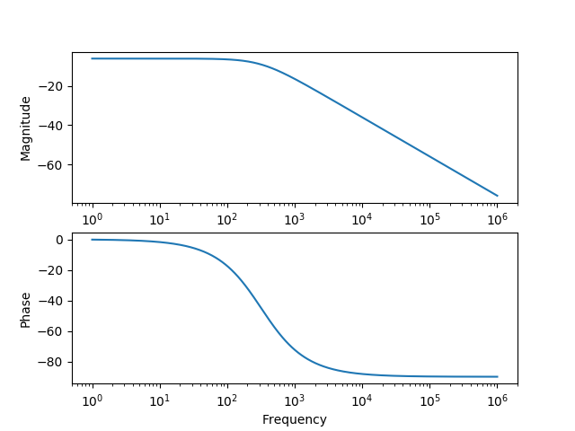
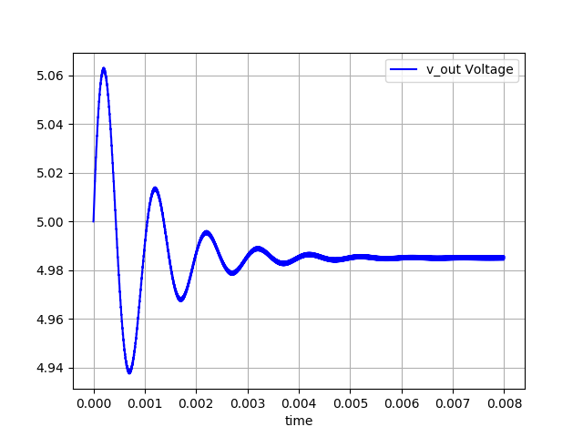
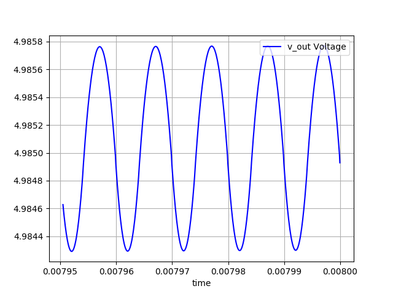
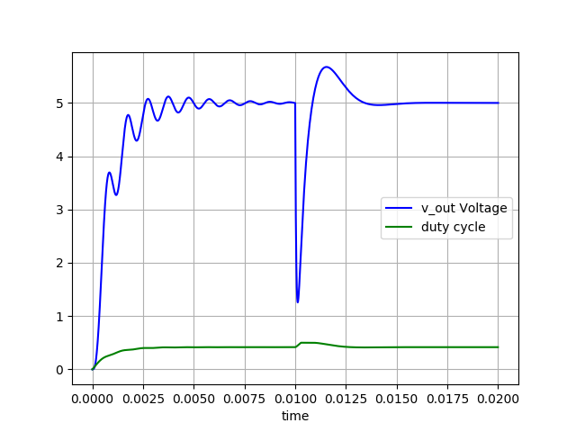

# Circuit Simulator

## Requirements
* Python 3.5+
* Numpy
* SciPy

## Examples

See "examples.py" for the full example source code.

### imports
```python
    import cmath, math

    import circuit_sim
    from circuit_sim import bode_plot, interpolate, line_chart
```

### DC Analysis
A resistor divider circuit:
```python
    circuit = """    
        R R1    vcc     v_out   1k
        R       v_out   gnd     1kOhm
    
        vcc = 2.5v 
        """
```
Circuit Description Language Syntax:
* Component names are optional - the first resistor is called R1, and the second one will get a name automatically assigned to
* The "gnd" is automatically referenced to 0v
* The units like "ohm" and "v" are optional


```python
    circuit = circuit_sim.Circuit.build_from_string(circuit)
    circuit.dc_analysis()

    print("v_out =", circuit.get_variable("v_out")) # 1.25
    circuit.print_equations()                       # (0.002)(v_out) = 0.0025
    circuit.print_all_variables()                   # v_out = 1.25
```

### Nonlinear DC Analysis
A diode in series with a resistor:
```python
    circuit = """
        R           vcc     v1      0.1
        D my_diode  v1      gnd     i0=1e-5 m=3 v0=0.5

        vcc = 5v 
        """
```
The diode is modeled as I = (i0) \* exp[m \* (v - v0)]

```python
    circuit = circuit_sim.Circuit.build_from_string(circuit)
    circuit.dc_analysis()
    circuit.print_all_variables()

    # v1 = 4.701818974760387
    # my_diode.internal_node = 0.33289232252030193
    # my_diode.current = 2.981810252396129
```
Using a calculator, you can verify that:
* diode current: 2.982 = 0.00001 \* exp ( 3 \* (4.70812-0.5))
* resistor current: 2.982 = (5 - 4.70182) / 0.1

### Transient Simulation
An RC circuit being charged:
```python
    circuit = """
        R   vcc     v_out   1k
        R   v_out   gnd     1k
        C   v_out   gnd     30uF
        
        vcc = 1V
        """
```
To plot the "v_out":
```python
    circuit = circuit_sim.Circuit.build_from_string(circuit)
    time_stamps, results = circuit.transient_simulation(0, 100e-3, ["v_out"])

    line_chart(x_label="time",
               #    [   x,            y,           graph_title   ]
               data=[time_stamps, results[0], "Capacitor Voltage"],
               legend_location="center right")
```


### AC Sweep
A RC circuit:
```python
    circuit = """
        R   vcc     v_out   1k
        R   v_out   gnd     1k
        C   v_out   gnd     1uF

        vcc = 1V
        """
```
To make a Bode plot:
```python
    circuit = circuit_sim.Circuit.build_from_string(circuit)
    freq, results = circuit.ac_sweep(["v_out"])
    bode_plot(freq, results[0])
```


### Modifying Components during Transient Analysis
Example: buck converter output ripple modeling

A 12v to 5v buck converter model:
```python
    circuit = """
            VG  vg      v_sw    gnd     12v
            L   L1      v_sw    v_out   50uH    v0=0    i0=5   
            C   C1      v_out   gnd     500uF   v0=5    i0=0
            R   R_load  v_out   gnd     1ohm
            """
```
Note the use of initial conditions for "L1" and "C1" to start the buck converter near it's steady state.

A buck converter applies a square wave into an LC circuit.

This is modeled by setting "vg" to 12v, then to 0v, then back to 12v, and so on.
```python
    circuit = circuit_sim.Circuit.build_from_string(circuit)
    time_stamps, results = circuit.transient_simulation(0, 0, ["v_out"])

    on_time = 10e-6 * 5 / 12
    off_time = 10e-6 - on_time

    for i in range(0, 800):
        vg = circuit.get_component_for_modification("vg")
        vg.value = 12
        circuit.continue_transient_simulation(on_time, time_step=100e-9)

        vg = circuit.get_component_for_modification("vg")
        # The "get_component_for_modification" needs to be called again
        # and again because it registers the "vg" component as having
        # been modified.
        vg.value = 0
        circuit.continue_transient_simulation(off_time, time_step=100e-9)
```
This transient analysis will take some time to run.

The initial conditions put the circuit close to its stead state, but it's not exactly at the steady state. The long transient simulation is to put the model into its steady state.

To see the output voltage during the long transient simulation:
```python
    line_chart(x_label="time",
               data=[time_stamps, results[0], "v_out Voltage"],
               legend_location="upper right")
```


The steady state is not 5v due to approximations used during the transient simulation. The code is using a time step of 100ns, meaning 100 steps per 10us switching cycle. If a smaller time step is used, then the steady state output will be closer to 5v, at a cost of a longer simulation time.

The switching ripple is visible if one zooms into the last few switching cycles:
```python
    line_chart(x_label="time",
               data=[time_stamps[-500:], results[0][-500:], "v_out Voltage"],
               legend_location="upper right")
```


### Digital Control

This example is rather long and not all of the code is provided below. The code involves three items:
* the function "digital_buck()" is the example's entry point
* the class "Controller" models the buck converter's digital controller
* the function "run_buck_converter(...)" runs the buck circuit for a single switching cycle

This "README.md" file will only go over "digital_buck()", so import the other two items:

```python
from examples import Controller, run_buck_converter
```

A 12v to 5v buck converter model:
```python
    circuit = """
            VG  vg      v_sw    gnd     12v
            L   L1      v_sw    v_out   50uH   
            C   C1      v_out   gnd     500uF
            R   R_load  v_out   gnd     1ohm
            """
```
Unlike in the previous example, the "L1" and "C1" are initialized to close the operating point. In this example, these components start off at 0v.

To prepare for the simulation:
```python
    circuit = circuit_sim.Circuit.build_from_string(circuit)
    time_stamps, results = circuit.transient_simulation(0, 0, ["v_out"])
    duty_cycle_data = []
    duty_cycle_data_t = []

    controller = Controller(circuit)
```

The duty cycle is not part of the circuit, so a separate list is allocated. The duty cycle is also not sampled at the same rate as the circuit, so a separate "_t" list is used to hold the time stamps. The code inside ""run_buck_converter(...)" simulates the circuit elements using 10 time steps per 10us switching cycle. During this same time period, there is only one duty cycle value, and only one duty timestamp, which is why the "duty_cycle_data[]" list is ten times shorter than the circuit simulation data.

To run the buck converter for 1000 cycles:
```python
    # starting condition: 1 ohm load
    run_buck_converter(circuit, controller, duty_cycle_data,
                       duty_cycle_data_t, num_cycles=1000)
```

Next, change the load resistor and then run the buck converter for another 1000 cycles.
```python
    # change load to 0.1 ohm
    r_load = circuit.get_component_for_modification("R_load")
    r_load.value = 0.1

    run_buck_converter(circuit, controller, duty_cycle_data,
                       duty_cycle_data_t, num_cycles=1000)
```

Plot the output voltage:
```python
    line_chart(x_label="time",
               #    [   x,            y,        graph_title  ]
               data=[time_stamps, results[0], "v_out Voltage",
                     duty_cycle_data_t, duty_cycle_data, "duty cycle"],
                     legend_location="center right")
```



This is bad! Good thing this is a circuit simulator project and not a power supply project...

**Improving the control**

To keep the example simple, the code inside the "Controller" class is just using proportional control, and it's using voltage mode only.

In addition to more complex compensation schemes, current mode control can be implemented by reading the inductor current, using:
```python
    i_L = self.__circuit.get_variable("L1.current")
```

